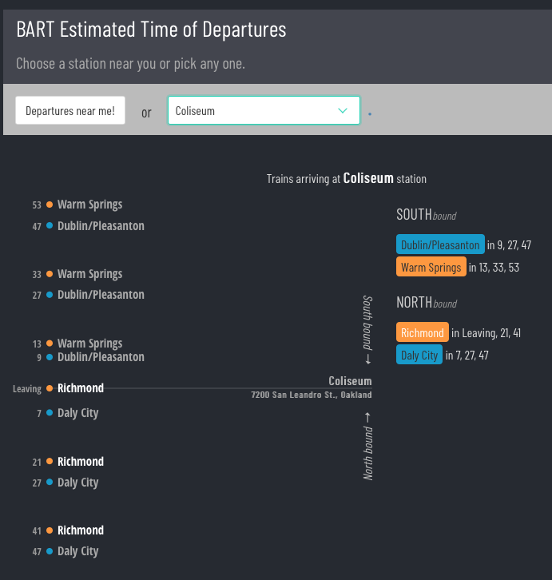

# BARTUp

A web-app that visualizes the [real-time BART departures](https://www.bart.gov/schedules/eta) for a station near you. An experiment while learning visualization, visual design, and the Clojure and Clojurescript languages.

Also available as an [iOS app](https://itunes.apple.com/us/app/bart-up/id1163667213?mt=8).